<!--
_class: lead gaia
_paginate: false
-->
# kubernetes简介

---
<!-- backgroundColor: white -->
## 目录
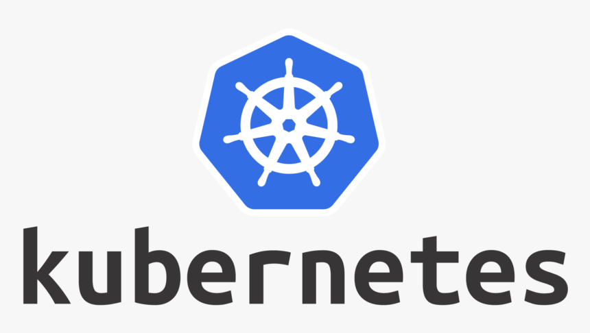
- 容器技术回顾
- 生产实践中的问题
- kubernetes的架构
- k8s中的常用对象
- k8s中使用网络
- k8s中使用存储卷
- k8s中暴露服务
- 其它实践经验

---
## 容器技术的本质
容器本质上是一个`集装箱`，它将应用运行依赖的`系统库`、`环境`及`应用程序`本身要包到一起，这样将整个集装箱迁移到另外的环境，可以保证程序`隔离不受干扰地`完美地运行起来。

---
## 容器依赖的两大核心技术-内核的隔离技术
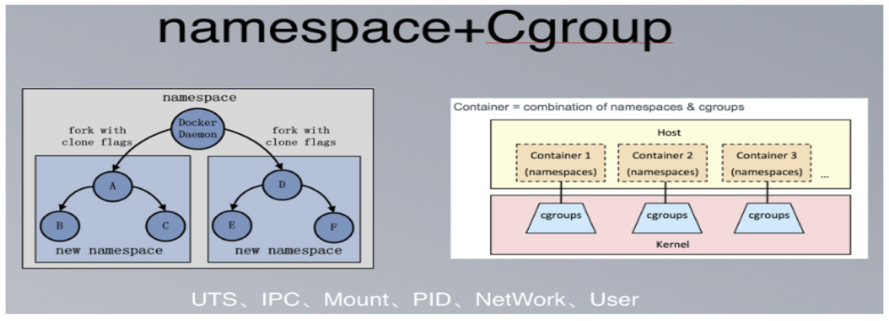
- Linux通过6大namespace, 就能在OS层面上同时运行多个相互独立的子系统
- Linux通过cgroup技术可以对资源进行划分

---
## 容器依赖的两大核心技术-联合文件系统
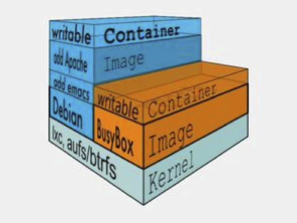

---
## Docker就是组合的创新

[100行bash脚本实现的简易Docker](https://github.com/p8952/bocker/blob/master/bocker)

---
## 生产实践中的问题
- 资源管理、容器调度
- 容器应用的部署、维护和滚动升级
- 容器跨节点通信
- 容器应用的服务发现和负载均衡
- 容器应用的存储卷支持
- 状态监控及自愈

[为什么kubernetes如此有用？](https://kubernetes.io/zh/docs/concepts/overview/what-is-kubernetes/)

---
## kubernetes的架构
这次我们换个方式来理解k8s的架构，我们从要解决的问题出发，逐步推导出kubernetes的架构，这样才能印象深刻。

问题有N台服务器，想以容器的形式部署某一个业务服务，要求M个副本，如何实现一个`调度系统`完成容器的创建、调度？

---
## kubernetes的架构-声明式设计
我们向一个工具描述我们想要让一个事物达到的目标状态，由这个工具自己内部去figure out如何令这个事物达到目标状态。

和`Declarative`（声明式设计）相对的是`Imperative`或`Procedural`（过程式设计）。

两者的区别是：在`Declarative`中，我们描述的是目标状态`Goal State`，而在`Imperative`模式中，我们描述的是一系列的动作。这一系列的动作如果被正确的顺利执行，最终结果是这个事物达到了我们期望的目标状态的。

---
## kubernetes的架构-我的假想
如果自己造一个容器编排系统，将从哪里开始：

- 元数据仓库，用于存储当前的资源信息、目标状态等
- 将存储目标状态转换为实际可调度的单元，并维护目标状态、调度单元的状态
- 进行实际编排的调度器
- 辅助在服务器上执行容器操作的抽象层
- 底层的容器实现
- 接收目标状态、输出当前状态的API接口层服务

---
## kubernetes的架构
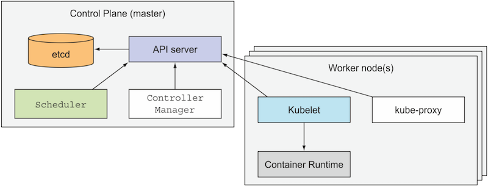

---

## kubernetes的架构
- etcd: 基于Raft一致性协议的key/value分布式存储，存储k8s的数据和状态信息。
- Controller Manager: 内置了多种控制器（DeploymentController、ServiceController、NodeController等），是Kubernetes维护业务和集群状态的最核心组件。
- Scheduler: 监听apiserver，发现有待调度的Pod，则按照配置的调度策略绑定到合适的Node上，并把绑定信息写入到etcd。
- API Server: 提供了Kubernetes中各种对象（Pod, Deployment, Service等）的Restful接口，Kubernetes中各个组件的通信枢纽。
- Kubelet: 负责Node节点上Pod生命周期管理，包括Pod的创建、销毁、容器监控数据采集、Node状态同步等。
- Kube-proxy: Node节点上的服务网络代理，通过apiserver取到Service、Endpoint等对象信息，根据配置的方式完成服务的反向代理及负载均衡。
- Container Runtime: 底层的容器实现方案，可能是dockerd、containerd, runc等。

---
## k8s常用对象-格式
#### 对象规约（Spec）与状态（Status）
etcd中存储了大量的kubernetes对象，这些对象的格式很类似：
> 每个Kubernetes对象包含两个嵌套的对象字段，它们负责管理对象的配置：对象spec和对象status。 
`spec`是必需的，它描述了对象的 期望状态（Desired State） —— 希望对象所具有的特征。 
`status`描述了对象的 实际状态（Actual State） ，它是由 Kubernetes 系统提供和更新的。在任何时刻，Kubernetes 控制面一直努力地管理着对象的实际状态以与期望状态相匹配。

---

## k8s常用对象-分类
常用的对象分类有以下几种：
- workload类：工作负载类，包括：`pod`、`deployment`、`statefulset`、`daemonset`、`job`
- discovery&loadbalance类：与服务相关，包括：`service`、`endpoint`、`ingress`
- config&storage类：应用初始化配置相关，包括：`configmap`、`secret`、`persistentVolumeClaim`
- cluster类：集群类对象，包括：`Node`、`namespace`、`persitenceVolume`、`serviceAccount`、`clusterRole`、`ClusterRoleVindeing`、`ResoruceQuota`

---
## k8s常用对象-操作
- 增：`kubectl create -f obj-manifest.yaml`
- 删：`kubectl delete -f obj-manifest.yaml` or `kubectl delete ${object-type} ${object-name}`
- 改：`kubectl apply -f obj-manifest.yaml` or `kubectl edit ${object-type} ${object-name}`
- 查：`kubectl get ${object-type} -l ${some-label}`

---
## k8s中使用网络-介入时机
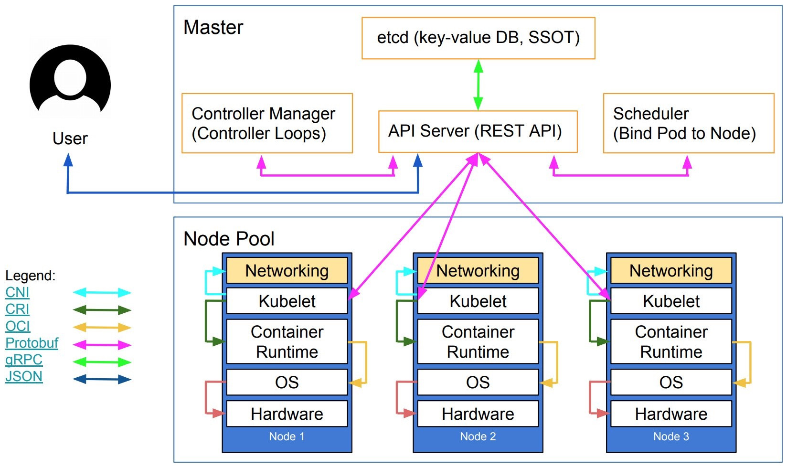
`kubelet`调用`Container Runtime`创建好容器后，就要通过`CNI`规范给容器设置好网络

---
## k8s中使用网络-模型规约
- 任意两个pod之间其实是可以直接通信的，无需经过显式地使用NAT来接收数据和地址的转换
- node与pod之间是可以直接通信的，无需使用明显的地址转换
- pod看到自己的IP跟别人看见它所用的 IP 是一样的，中间不能经过转换

---
## k8s中使用网络-模型图示
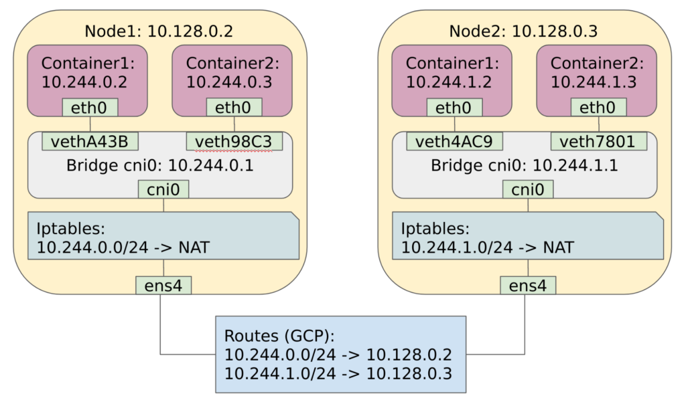

---

## k8s中使用存储卷-介入时机
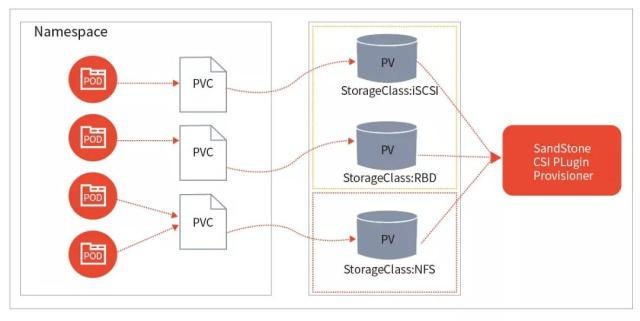
当使用到`persistentVolumeClaim`的工作负载在某个`Node`节点上运行起来时，kubernetes通过`CSI`规范为之创建对应的`persitenceVolume`，并将之挂载到工作负载上。

---
## k8s中使用存储卷-存储架构
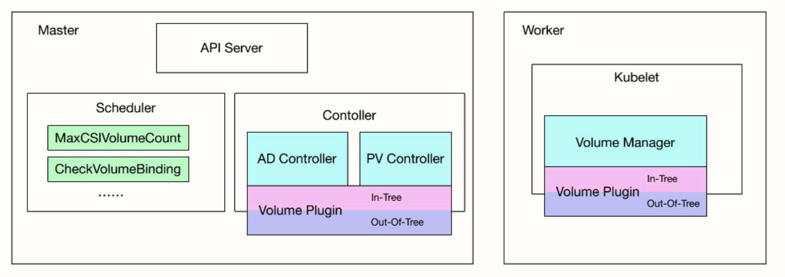

---
## k8s中使用存储卷-存储架构
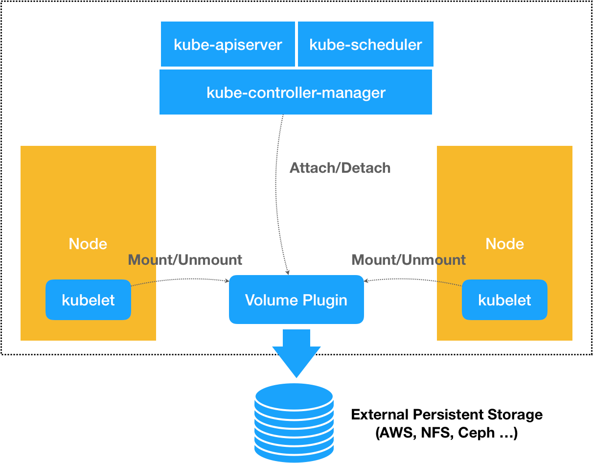

---

## k8s中使用存储卷-存储架构

当需要存储卷时：`Provision->Attach->Mount`
当不需要存储卷时：`Unmount->Dettach->Delete`

- `PV Controller`: 负责`PV`/`PVC`的绑定、生命周期管理，并根据需求进行数据卷的`Provision`/`Delete`操作；
- `AD Controller`：负责存储设备的`Attach`/`Detach`操作，将设备挂载到目标节点；
- `Volume Manager`：管理卷的`Mount`/`Unmount`操作、卷设备的格式化以及挂载到一些公用目录上的操作；
- `Volume Plugin`：它主要是对上面所有挂载功能的实现；`PV Controller`、`AD Controller`、`Volume Manager`主要是进行操作的调用，而具体操作则是由`Volume Plugin`实现的。

---
## k8s中暴露业务服务-基于Service的负载均衡
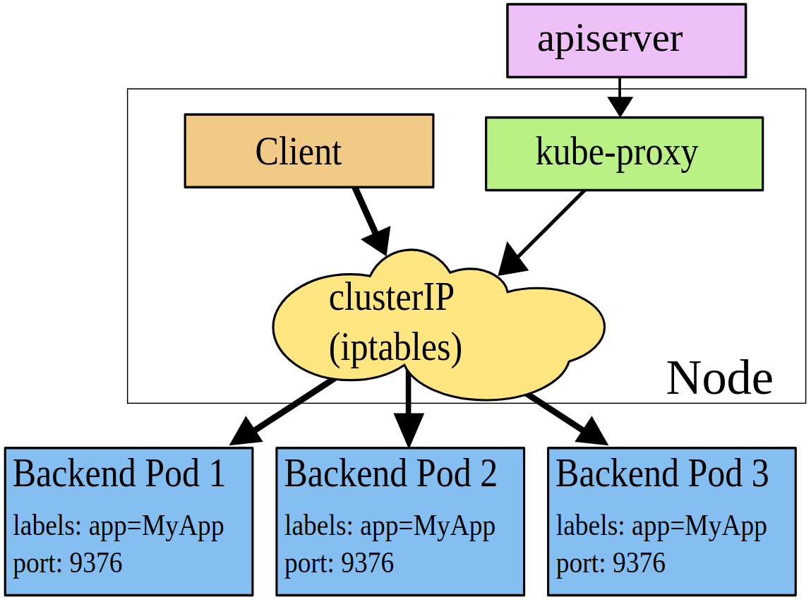

---

## k8s中暴露业务服务-服务的类型
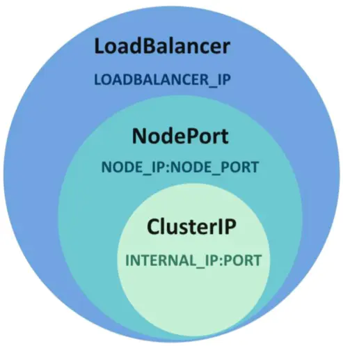
- `ClusterIP`：使用集群内的私有ip(默认值)
- `NodePort`：除了使用cluster ip外，也将service的port映射到每个node的一个指定内部port上，映射的每个node的内部port都一样
- `LoadBalancer`：使用一个ClusterIP & NodePort，但是会向cloud provider申请映射到service本身的负载均衡

---
## k8s中暴露业务服务-暴露HTTP/HTTPS服务
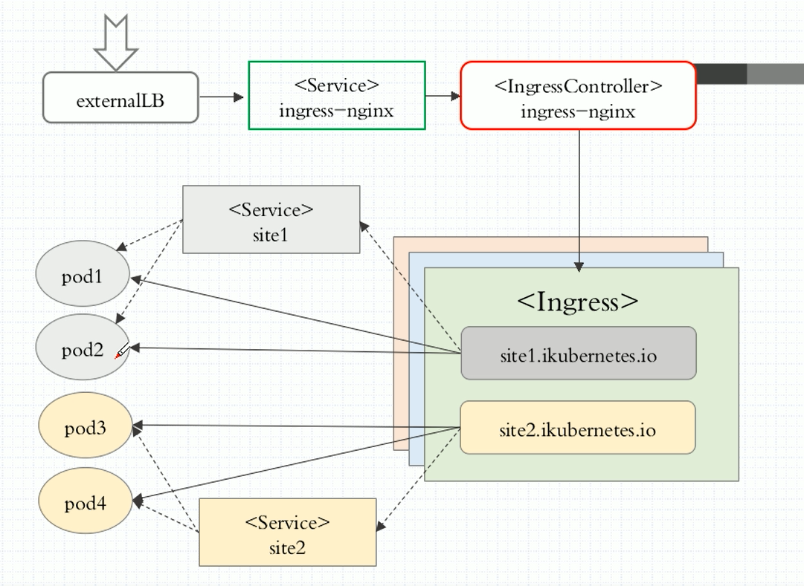

---

## 总结
kubernetes领域的知识包括很多，而且发展非常快，这里所讲只是冰山一角，其实这里的每个点都可以拿出来单讲，所以本篇只能算一个入门。希望通过此次分享能从心底里理解kubernetes这个容器编排的由来及其大概实现原理，后续的工作中如果涉及到能够心里有底，不慌不怵。

### 谢谢

---
## 附录
1. 快速部署一个kubernetes集群玩一玩，使用工具[sealos](https://github.com/fanux/sealos)
2. [kubernetes官方文档](https://kubernetes.io/zh/docs/home/)
3. [kubernetes网页界面](https://kubernetes.io/zh/docs/tasks/access-application-cluster/web-ui-dashboard/)
4. [tke开源项目](https://github.com/tkestack/tke)
5. [k8s-share](https://github.com/jeremyxu2010/k8s-share)

